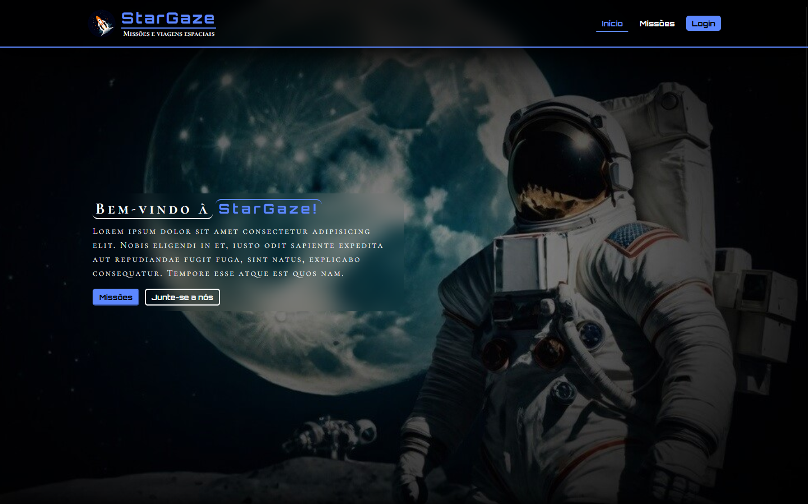

    
    <h1 align="center">StarGaze</h1>
    

 

Welcome! This is the repository for the **StarGaze** project, here you will find all the code and assets used in our project.

**Developers**: [Filipe Ramos](https://github.com/filipe-2), [Arthur Yvens](https://github.com/GOW-GuanYu), [Victor William](https://github.com/WillSouza21), [Yuri Castro](https://github.com/YuriCastroS), Marcelo

## Preview

## Description

This project consists of a single-page website for a Space Agency called **StarGaze**. Our goal consists in assisting the performance and organization of the StarGaze's space operations with an intuitive system for organizing its missions.

## Technologies used

We used the languages HTML, CSS, and JavaScript on the frontend and Python, together with the Flask framework, on the backend. We also used SQLite and SQLAlchemy.

 

## How to access the site 🔗

The website will be available soon, and the link will be available in this repository.
