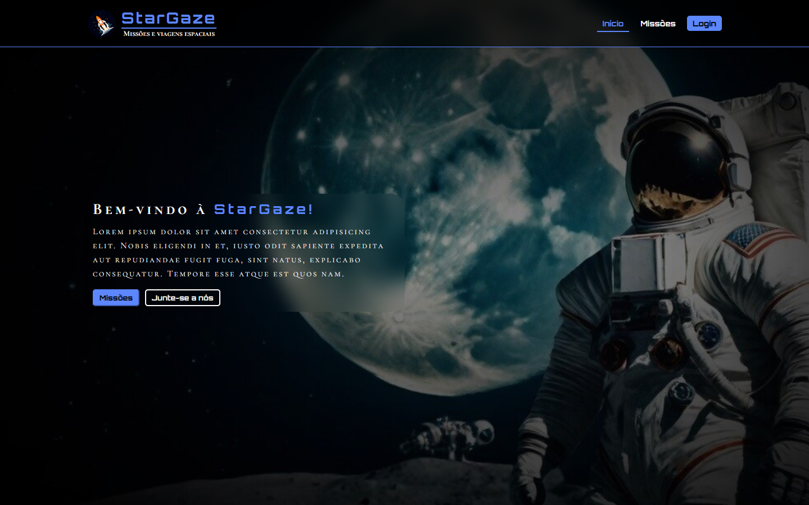

    
    <h1 align="center">StarGaze</h1>
    <h2 align="center">Space Agency</h2>

**Developers**: [Filipe Ramos](https://github.com/filipe-2), [Arthur Yvens](https://github.com/GOW-GuanYu), [Victor William](https://github.com/WillSouza21), [Yuri Castros](https://github.com/YuriCastroS)

Welcome! This is the repository for the **StarGaze** project, here you will find all the code and assets used in our project.

## Preview

## Description

This project consists of a single-page website for a Space Agency called **StarGaze**.

Technologies used:

## How to access 🔗

To access the StarGaze website, just [click here](https://filipe-2.github.io/stargaze/) or type [filipe-2.github.io/stargaze](https://filipe-2.github.io/stargaze/) on your browser and hit enter.
